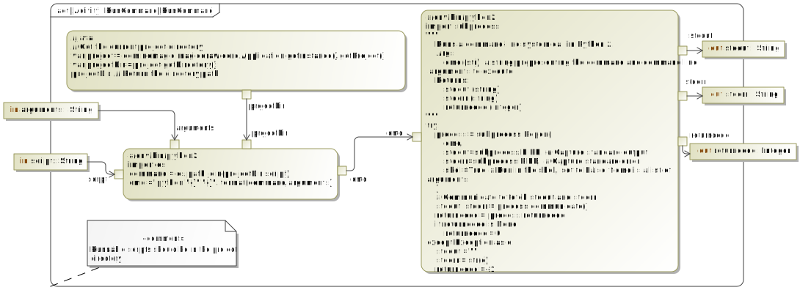

# Calling External Functions
CATAI Magic Systems of Systems Architect (MSOSA) has a great feature to call external programs for analysis. These are called using Opaque Actions. This example demonstrates how to call Python 3 functions from MSOSA Activity Diagrams.

This directory should contain the following
 * .MDZIP files, which are the native file for MSOSA.
 * .py files, which are the external helper functions.
 * Screenshots and diagram images to show the procedure.
 * README.md (this file) that has code snippets for the opaque actions.
 
## Setting up the Model
For this minimal example, setup a Systems Context and establish Use Cases. From the Use Case, we'll call an activity diagram. There will be a couple helper actions that we can use to glue the inputs and outputs.

The external functions should be commandline interfaces and use the argument parser to process inputs from the a command line interface (CLI). In this case, input arguments must not contain new line or carriage return characters and be input as ASCII. If more complex inputs are needed, then file saving and reading can be used. 

If binary (i.e. non-ASCII) data is needed, we'll encode the data using base64. 

### Example: Asymmetric Keys
THis example is to generate a public-private key pair using Ellipic Curve Cryptograpy. This is useful to ensure the system modeler is able to generate and demonstrate an instance that is mathematically correct. A private key is used to derive a public key. Therefore, the private key must be generated first. If a systems modeler were to reverse these oprations in a bahavior model, there are no built-in checks to catch this. Without calling external functions, MSOSA and the model analyst would simply pass an execution token from one action to another without regards to the mathematical artifacts generated with those actions. In this example, however, we'll show the artifact generation and the process will fail if not done in the correct order. This helps with model checking.

### System Context


### Use Cases

### Activity Diagram

### Helper Functions
In the RunCommand activity diagram, there are three opauqe functions. The first function is some javascript to determine the project directory. This is important becasue the default working directory is protected and users cannot save external scripts. Also, it is much easier to manage the project when the .MDZIP file and the .py files are co-located.

```
//java
// Get the current project directory
var project = com.nomagic.magicdraw.core.Application.getInstance().getProject();
var projectDir = project.getDirectory();
projectDir; // Return the directory path
```

The second opaque function is to create a command line string that would be representative of the actual characters typed into a terminal. The value of `cmd` should execute at the command prompt.

```
#/env/bin/python2
import os
command = os.path.join(projectDir,script)
cmd = 'python "{}" "{}"'.format(command,arguments)
```

The third function, which is the core of the process, uses the Python2 subprocess module to call the external function. The command generates 3 outputs, a return code, standard out and standard error. A try/except block is included with corresponding output to aid in the troubleshooting of the scripts.  

```
#/env/bin/python2
import subprocess
"""
    Runs a command-line system call in Python 2.
    Args:
        cmd (str): a string prepresenting the command and command line arguments to execute.
    Returns:
        stdout (string)
        stderr (string)
        returncode (integer)
"""
try:
    process = subprocess.Popen(
        cmd,
        stdout=subprocess.PIPE,  # Capture standard output
        stderr=subprocess.PIPE,  # Capture standard error
        shell=True  # Run in the shell, set to False if cmd is a list of arguments
    )
    # Communicate to fetch stdout and stderr
    stdout, stderr = process.communicate()
    returncode =  process.returncode
    if returncode is None:
        returncode = 0
except Exception as e:
    stdout = ""
    stderr = str(e)
    returncode = -1
```

The variables, input and output are shown in the completed activity diagram.




## Results
