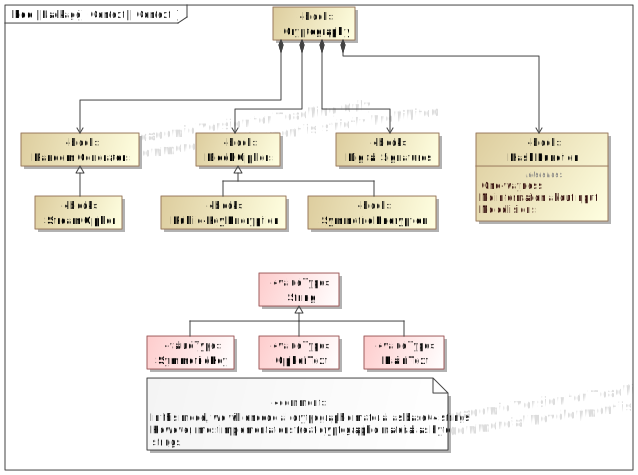
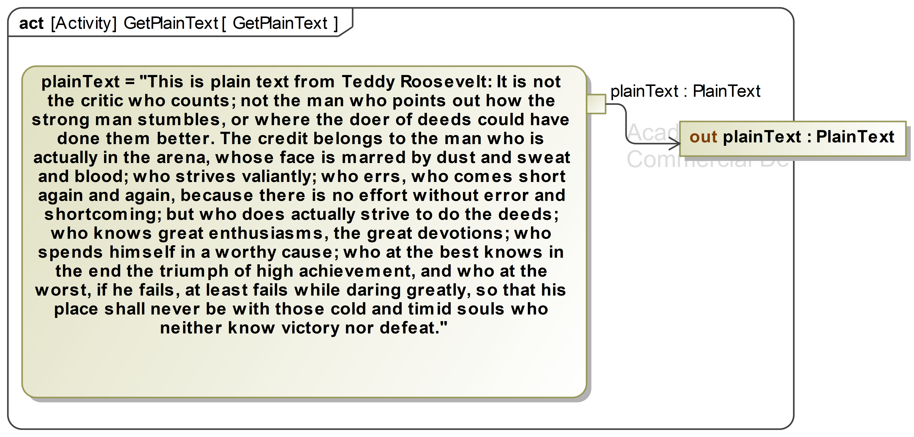
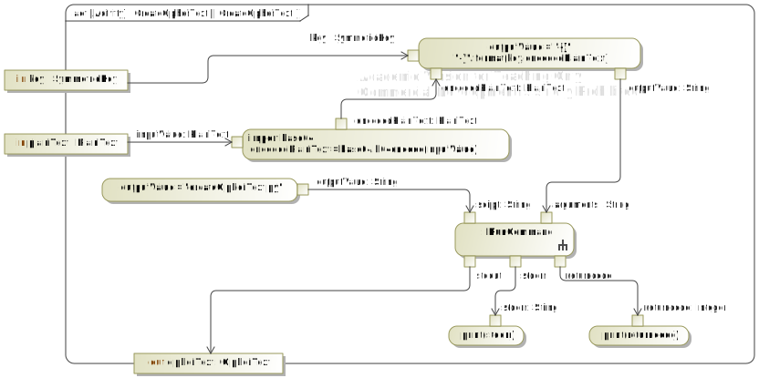
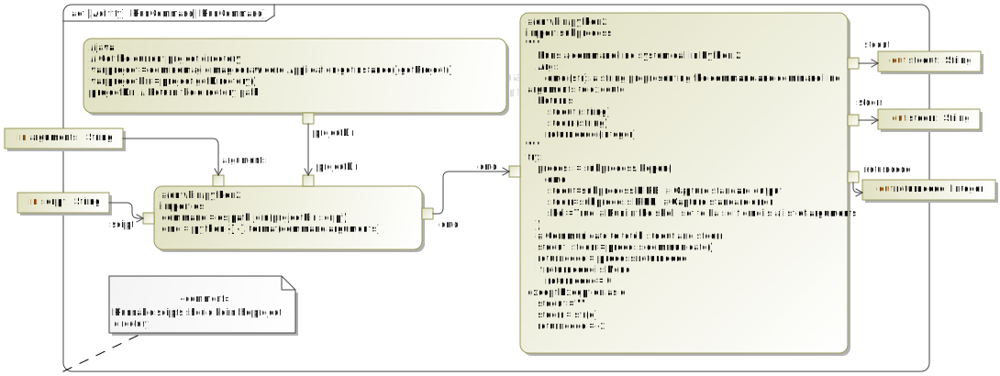

# MSOSA Cryptography Examples
The Magic Model Analyst in MSOSA is a helpful tool for visualizing behavioral diagrams in CATIA Magic Systems of Systems Architect, used for Model-Based Systems Engineering (MBSE). The simulation tool is also flexible enough to enable modelers to call external programs and write custom code in different languages, one of which is Python. However, the Python deployment in MSOSA 2024 is version 2, which does not support the `bytes` and `bytearray` data types. This means libraries that depend on these data types are not available within MSOSA, such as the library documented at [https://cryptography.io](https://cryptography.io).

For this repository and its examples, the goal is to simulate some basic cryptographic recipes to demonstrate system design in simulated SysML activity diagrams. Since we want to use Python 3 for the examples, we must also craft external command-line scripts to call with opaque actions in the nested activity diagrams. This is a useful feature, so the package containing the `RunCommand` activity diagram is available in this repository at [CallingExternalFunctions](https://github.com/SystemsCyber/MBSE/tree/main/CallingExternalFunctions).

This directory should contain the following:
 * `.MDZIP` files, which are the native files for MSOSA.
 * `.py` files, which are the external helper functions.
 * Screenshots and diagram images to show the procedure.
 * `README.md` (this file), which contains examples from the files.
 
## Setting up the Model
For this minimal example, we'll set up a Systems Context and establish Use Cases. From the Use Cases, we'll call an activity diagram to model them.

The external functions should be command-line interfaces and use the argument parser to process inputs from a command-line interface (CLI). In this case, input arguments must not contain new-line or carriage return characters and must be input as ASCII, so most data is passed into the functions as base64-encoded command-line arguments. Therefore, most Python files in this directory will use `argparse` to separate the various inputs. Also, the outputs are likely base64-encoded strings pushed to the standard output (`stdout`). If more complex inputs are needed, file saving and reading can be used.

Since binary data is needed for cryptographic material, we'll encode the data using base64.

### Example: Alice wants to send an encrypted message to Bob
This example uses symmetric encryption (AES-128 in CFB mode) to exchange private messages. The actors, Alice and Bob, have a shared secret password. This password is not very strong, but it serves as a basic example. Password security is a challenge in modern distributed computing. Using a password manager to generate complex, unique, and long passwords is the minimum standard of care these days.

### System Context
The examples and files in this directory have a system context modeled as a SysML block definition diagram (bdd) to show different concepts in cryptography. This hierarchy was inspired by Chapter 5 in Ross Anderson's *Security Engineering* text: [https://www.cl.cam.ac.uk/archive/rja14/book.html](https://www.cl.cam.ac.uk/archive/rja14/book.html). The bdd to show context is as follows:



In this model, the values used in the cryptographic operations are passed between actions and activities as strings because they are binary blobs encoded as base64 strings. Practical implementations outside MSOSA will treat these as bytes in Python.

### Use Cases
The use case diagram shows Alice encrypting a message and Bob decrypting the message, with the context being symmetric encryption.


The rake symbol in the Encrypt Message use case indicates that there is an embedded activity diagram modeling the use case.

### Activity Diagram

The high-level activity diagram for the Encrypt Message use case is as follows:


Each of these actions calls embedded actions (as seen with the rake symbol). They all call external functions, so the embedded activity diagrams mainly use opaque actions to set up the arguments for calling external functions. The following images show the five embedded activity diagrams from the Encrypt Message namespace.

#### Password
The `RequestPassword` activity diagram is as simplistic as possible. There is a hardcoded password assigned to the output pin of an opaque action. This simple syntax is valid in most computer languages. A system should never use hardcoded passwords, but this example assumes that both parties know the same password, which may not be the best system design.


#### Key Derivation
The `DeriveKey` activity diagram sets up the `RunCommand` behavior, which was imported from a different project as a read-only package. Since `RunCommand` has two arguments as inputs (script name and arguments), they need to be defined. In this case, the script to call is [`deriveKey.py`](deriveKey.py). The outputs are `stdout`, `stderr`, and a numerical return code. When the function works as expected, only `stdout` is used. The other outputs can be used for debugging by looking at their contents in the MSOSA simulation console.


The `deriveKey.py` script uses a salt to add entropy to the hash and create a salted derived key. This means the password and the salt value will be needed to recreate the symmetric 16-byte key. This is saved as the binary file [`salt.bin`](salt.bin).

#### Plain Text
The plain text input for this example is defined similarly to the password. The example is a snippet from Teddy Roosevelt's famous *Man in the Arena* speech.



The activity of collecting the plain text from the user or subsystem is beyond the scope of this example. Therefore, we chose to "hardcode" the plain text, much like we did for the password. Practical systems will have some sort of plain text gathering and processing functions. Also, plain text does not have to be human-readable; it is simply a term used in cryptography for the data that gets protected.

#### Encipher the Data
The `CreateCipherText` activity diagram shows how the plain text is encoded as base64 to be used as one of the arguments. The other argument is the symmetric key, which was already encoded as base64. The script [`createCipherText.py`](createCipherText.py) is the core logic of this example. It uses the AES cipher in CFB mode with 128-bit blocks. The documentation for this is available at [https://cryptography.io/en/latest/hazmat/primitives/symmetric-encryption/](https://cryptography.io/en/latest/hazmat/primitives/symmetric-encryption/).



Since the script takes two arguments, the opaque action in Python of  
`outputValue = '"{}" "{}"'.format(key, encodedPlainText)`  
is able to combine two inputs into a string, with each input encapsulated in quotes.

The output is the ciphertext and the initialization vector in a dotted base64 string. The base64-encoded ciphertext is first, followed by the base64-encoded initialization vector: `ciphertext.iv`. This format enables the result to be on a single line since it is transferred to another function as a command-line argument.

#### Save the Ciphertext
Finally, the example saves the output in JavaScript Object Notation (JSON) format. Since the data has already been encoded as base64, the JSON structure is straightforward. An example of the JSON output is as follows:

```json
{
    "ciphertext": "VK9qdDvxuyOhDVg/K3uWo/p8X71ChyyXikSjjIdMd2bUYA==", 
    "iv": "X22hvN7/n8RrHpat4+xOVQ=="
}
```

To reverse this process and recover the plain text message, four elements are needed:
1. Ciphertext
2. Initialization Vector
3. Password
4. Key Derivation Function Salt

#### RunCommand

The utility to run external commands is saved in a separate file and importable as a package. The activity diagram for RunCommand is as follows:



# Summary

This example demonstrates how to generate authentic cryptographic artifacts for use in CATIA MSOSA behavior modeling and simulation. Including external functions capable of cryptographic operations ensures that activities are properly modeled and that the sequence of actions is realistic.